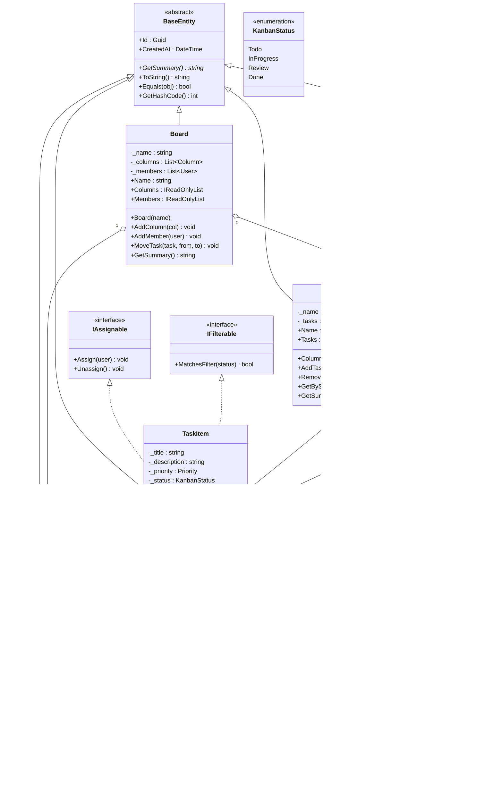

# KanbanTracker

```mermaid
classDiagram
    direction TB

    class BaseEntity {
        <<abstract>>
        +Id : Guid
        +CreatedAt : DateTime
        +GetSummary() string*
        +ToString() string
        +Equals(obj) bool
        +GetHashCode() int
    }

    class IAssignable {
        <<interface>>
        +Assign(user) void
        +Unassign() void
    }

    class IFilterable {
        <<interface>>
        +MatchesFilter(status) bool
    }

    class KanbanStatus {
        <<enumeration>>
        Todo
        InProgress
        Review
        Done
    }

    class Priority {
        <<enumeration>>
        Low
        Medium
        High
    }

    class User {
        -_name : string
        -_email : string
        +Name : string
        +Email : string
        +User(name, email)
        +GetSummary() string
    }

    class TaskItem {
        -_title : string
        -_description : string
        -_priority : Priority
        -_status : KanbanStatus
        -_assignee : User
        -_subtasks : List~TaskItem~
        +Title : string
        +Status : KanbanStatus
        +Priority : Priority
        +Assignee : User
        +Subtasks : IReadOnlyList
        +TaskItem(title, priority)
        +TaskItem(title, desc, priority)
        +Assign(user) void
        +Unassign() void
        +MoveToStatus(status) void
        +AddSubtask(task) void
        +MatchesFilter(status) bool
        +GetSummary() string
    }

    class BugReport {
        +StepsToReproduce : string
        +ExpectedBehavior : string
        +ActualBehavior : string
        +BugReport(title, steps, expected, actual)
        +GetSummary() string
    }

    class Column {
        -_name : string
        -_tasks : List~TaskItem~
        +Name : string
        +Tasks : IReadOnlyList
        +Column(name)
        +AddTask(task) void
        +RemoveTask(task) void
        +GetByStatus(status) List
        +GetSummary() string
    }

    class Epic {
        -_title : string
        -_tasks : List~TaskItem~
        +Title : string
        +Tasks : IReadOnlyList
        +Epic(title)
        +AddTask(task) void
        +RemoveTask(task) void
        +GetSummary() string
    }

    class Board {
        -_name : string
        -_columns : List~Column~
        -_members : List~User~
        +Name : string
        +Columns : IReadOnlyList
        +Members : IReadOnlyList
        +Board(name)
        +AddColumn(col) void
        +AddMember(user) void
        +MoveTask(task, from, to) void
        +GetSummary() string
    }

    BaseEntity <|-- User
    BaseEntity <|-- TaskItem
    BaseEntity <|-- Column
    BaseEntity <|-- Epic
    BaseEntity <|-- Board
    TaskItem <|-- BugReport

    IAssignable <|.. TaskItem
    IFilterable <|.. TaskItem

    Board "1" o-- "0..*" Column
    Board "1" o-- "0..*" User
    Column "1" o-- "0..*" TaskItem
    Epic "1" o-- "0..*" TaskItem
    TaskItem "1" o-- "0..*" TaskItem : subtasks
    TaskItem "0..1" --> "0..1" User : assignee
```
