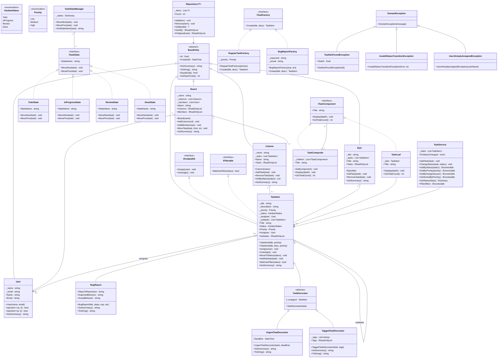

# KanbanTracker

```mermaid
classDiagram
    direction TB

    class BaseEntity {
        <<abstract>>
        +Id : Guid
        +CreatedAt : DateTime
        +GetSummary() string*
        +ToString() string
        +Equals(obj) bool
        +GetHashCode() int
    }

    class IAssignable {
        <<interface>>
        +Assign(user) void
        +Unassign() void
    }

    class IFilterable {
        <<interface>>
        +MatchesFilter(status) bool
    }

    class KanbanStatus {
        <<enumeration>>
        Todo
        InProgress
        Review
        Done
    }

    class Priority {
        <<enumeration>>
        Low
        Medium
        High
    }

    class User {
        -_name : string
        -_email : string
        +Name : string
        +Email : string
        +User(name, email)
        +operator==(a, b) bool
        +operator!=(a, b) bool
        +GetSummary() string
    }

    class TaskItem {
        -_title : string
        -_description : string
        -_priority : Priority
        -_status : KanbanStatus
        -_assignee : User
        -_subtasks : List~TaskItem~
        +Title : string
        +Status : KanbanStatus
        +Priority : Priority
        +Assignee : User
        +Subtasks : IReadOnlyList
        +TaskItem(title, priority)
        +TaskItem(title, desc, priority)
        +Assign(user) void
        +Unassign() void
        +MoveToStatus(status) void
        +AddSubtask(task) void
        +MatchesFilter(status) bool
        +GetSummary() string
    }

    class BugReport {
        +StepsToReproduce : string
        +ExpectedBehavior : string
        +ActualBehavior : string
        +BugReport(title, steps, exp, act)
        +GetSummary() string
        +ToString() string
    }

    class Column {
        -_name : string
        -_tasks : List~TaskItem~
        +Name : string
        +Tasks : IReadOnlyList
        +Column(name)
        +AddTask(task) void
        +RemoveTask(task) void
        +GetByStatus(status) List
        +GetSummary() string
    }

    class Epic {
        -_title : string
        -_tasks : List~TaskItem~
        +Title : string
        +Tasks : IReadOnlyList
        +Epic(title)
        +AddTask(task) void
        +RemoveTask(task) void
        +GetSummary() string
    }

    class Board {
        -_name : string
        -_columns : List~Column~
        -_members : List~User~
        +Name : string
        +Columns : IReadOnlyList
        +Members : IReadOnlyList
        +Board(name)
        +AddColumn(col) void
        +AddMember(user) void
        +MoveTask(task, from, to) void
        +GetSummary() string
    }

    class Repository~T~ {
        -_items : List~T~
        +Add(item) void
        +Remove(item) void
        +GetById(id) T
        +GetAll() IReadOnlyList
        +Find(predicate) IReadOnlyList
        +Count : int
    }

    class TaskService {
        -_tasks : List~TaskItem~
        +OnStatusChanged : event
        +AddTask(task) void
        +ChangeStatus(task, status) void
        +GetByStatus(status) IEnumerable
        +GetByPriority(priority) IEnumerable
        +GetByAssignee(user) IEnumerable
        +GetSortedByPriority() IEnumerable
        +GetStatusStats() Dictionary
        +Filter(filter) IEnumerable
    }

    class ITaskState {
        <<interface>>
        +StateName : string
        +MoveNext(task) void
        +MovePrev(task) void
    }

    class TodoState {
        +StateName : string
        +MoveNext(task) void
        +MovePrev(task) void
    }

    class InProgressState {
        +StateName : string
        +MoveNext(task) void
        +MovePrev(task) void
    }

    class ReviewState {
        +StateName : string
        +MoveNext(task) void
        +MovePrev(task) void
    }

    class DoneState {
        +StateName : string
        +MoveNext(task) void
        +MovePrev(task) void
    }

    class TaskStateManager {
        -_states : Dictionary
        +MoveNext(task) void
        +MovePrev(task) void
        +GetStateName(task) string
    }

    class ITaskFactory {
        <<interface>>
        +Create(title, desc) TaskItem
    }

    class RegularTaskFactory {
        -_priority : Priority
        +RegularTaskFactory(priority)
        +Create(title, desc) TaskItem
    }

    class BugReportFactory {
        -_expected : string
        -_actual : string
        +BugReportFactory(exp, act)
        +Create(title, desc) TaskItem
    }

    class ITaskComponent {
        <<interface>>
        +Title : string
        +Display(depth) void
        +GetTotalCount() int
    }

    class TaskLeaf {
        -_task : TaskItem
        +Title : string
        +Display(depth) void
        +GetTotalCount() int
    }

    class TaskComposite {
        -_children : List~ITaskComponent~
        +Title : string
        +Add(component) void
        +Display(depth) void
        +GetTotalCount() int
    }

    class TaskDecorator {
        <<abstract>>
        #_wrapped : TaskItem
        +TaskDecorator(task)
    }

    class UrgentTaskDecorator {
        +Deadline : DateTime
        +UrgentTaskDecorator(task, deadline)
        +GetSummary() string
        +ToString() string
    }

    class TaggedTaskDecorator {
        -_tags : List~string~
        +Tags : IReadOnlyList
        +TaggedTaskDecorator(task, tags)
        +GetSummary() string
        +ToString() string
    }

    class DomainException {
        +DomainException(message)
    }

    class TaskNotFoundException {
        +TaskId : Guid
        +TaskNotFoundException(id)
    }

    class InvalidStatusTransitionException {
        +InvalidStatusTransitionException(from, to)
    }

    class UserAlreadyAssignedException {
        +UserAlreadyAssignedException(userName)
    }

    %% Наслідування від BaseEntity
    BaseEntity <|-- User
    BaseEntity <|-- TaskItem
    BaseEntity <|-- Column
    BaseEntity <|-- Epic
    BaseEntity <|-- Board

    %% Наслідування TaskItem
    TaskItem <|-- BugReport
    TaskItem <|-- TaskDecorator

    %% Декоратори
    TaskDecorator <|-- UrgentTaskDecorator
    TaskDecorator <|-- TaggedTaskDecorator

    %% Інтерфейси
    IAssignable <|.. TaskItem
    IFilterable <|.. TaskItem
    ITaskState <|.. TodoState
    ITaskState <|.. InProgressState
    ITaskState <|.. ReviewState
    ITaskState <|.. DoneState
    ITaskFactory <|.. RegularTaskFactory
    ITaskFactory <|.. BugReportFactory
    ITaskComponent <|.. TaskLeaf
    ITaskComponent <|.. TaskComposite

    %% Агрегація
    Board "1" o-- "0..*" Column
    Board "1" o-- "0..*" User
    Column "1" o-- "0..*" TaskItem
    Epic "1" o-- "0..*" TaskItem
    TaskItem "1" o-- "0..*" TaskItem : subtasks
    TaskComposite "1" o-- "0..*" ITaskComponent
    TaskStateManager "1" o-- "4" ITaskState

    %% Асоціації
    TaskItem "0..1" --> "0..1" User : assignee
    TaskLeaf --> TaskItem
    TaskService --> TaskItem
    Repository~T~ --> BaseEntity

    %% Винятки
    DomainException <|-- TaskNotFoundException
    DomainException <|-- InvalidStatusTransitionException
    DomainException <|-- UserAlreadyAssignedException
```
